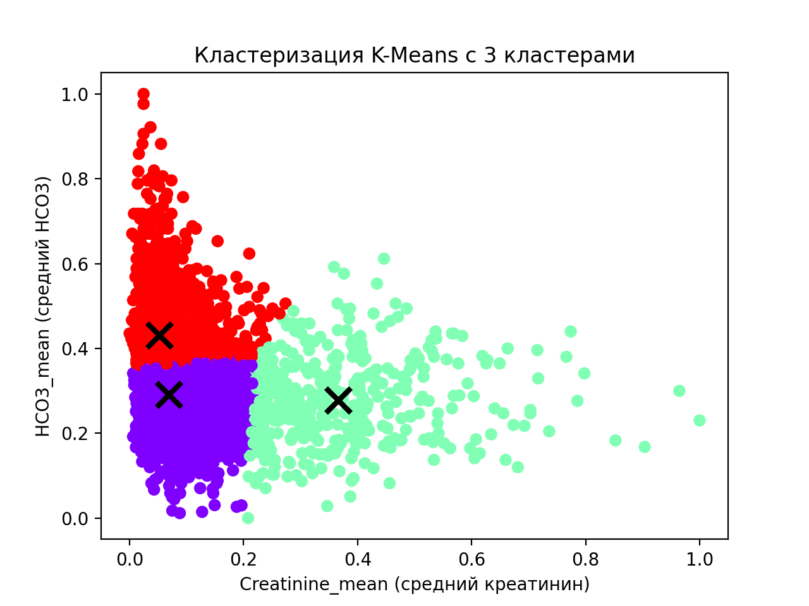

# ПВИС Лабораторная работа 2

---
Этот репозиторий содержит код для обработки изображений, многопоточных вычислений и 
кластеризации данных в рамках второй лабораторной работы по ПВИС.

---

## Требования
Убедитесь, что у вас установлены необходимые пакеты Python с помощью предоставленного файла requirements.txt. Вы можете сделать это, выполнив:
1. Клонируйте репозиторий:
```
git clone https://github.com/Sogato/pvis_lab2.git
```
2. Создайте виртуальное окружение:
```
python -m venv env
```
3. Установите зависимости проекта:
```
pip install -r requirements.txt
```

## Использование
### Program A
Для запуска программы А выполните:
```
python program_a/main.py
```
Program A загружает изображение, вычисляет его интенсивность, применяет порог и проводит эрозию.

#### Пример исходного изображения


####  Пример выходного изображения


### Program B
Для запуска программы B выполните:
```
python program_b/main.py
```
Program B применяет сдвиг к изображению на заданные значения по оси X и Y, а также применяет свертку к изображению.

#### Пример исходного изображения


####  Пример выходного изображения


### Program C
Для запуска программы B выполните:
```
python program_c/main.py
```
Program C выполняет кластеризацию данных из CSV файла с использованием метода K-Means, 
оценивает качество кластеризации с помощью индекса Данна, используя многопоточность для ускорения вычислений, 
и визуализирует результаты кластеризации.

####  Пример выходного изображения

